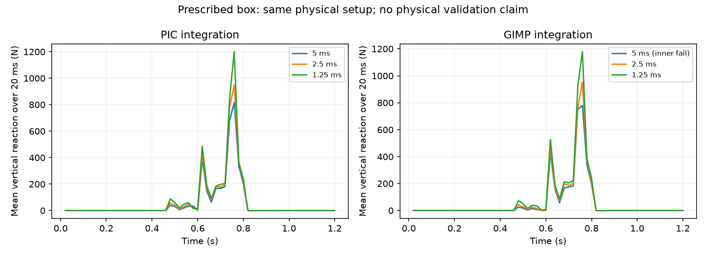

# Interpolation control for the prescribed-contact fixture

This study changes only Newton's integration scheme from `pic` to `gimp`, keeping
the physical fixture, APIC particle-grid transfer, 40 mm grid, 20 mm particle spacing,
20,000-iteration cap, 1e-5 residual tolerance and initialized stress-update scratch.
The `pic` integration setting is distinct from the particle-grid transfer setting;
these runs do not switch APIC transfer to PIC transfer.

The isolated source snapshot starts from `66f28c3` with an integration-scheme selector
added to the diagnostic script and the kernel cache redirected to the existing cache.
All three GIMP cases completed with unchanged source. Production defaults were not
changed.

| Timestep (ms) | Impulse (N s) | Peak 20 ms mean (N) | Steps outside inner tolerance |
|---|---:|---:|---:|
| 5 | 65.992 | 779.57 | 1 / 240 |
| 2.5 | 74.267 | 953.10 | 0 / 480 |
| 1.25 | 87.805 | 1178.90 | 0 / 960 |

The failed 5 ms step occurs at 0.545 s, with a reported L-infinity residual of
2.77e-4 after 20,001 reported iterations. It is not treated as inner-converged.
The two finer runs do meet the inner tolerance throughout, but their impulses differ
by approximately **18.2%**. GIMP therefore does not resolve the observed timestep
sensitivity in this fixture. It is not promoted as a physical correction.



The plot uses the same nonoverlapping 20 ms impulse windows as the recorded peak
metric. It introduces no smoothing or trial exclusions. The existing `pic` cases
are the inner-converged records described in `INNER_SOLVER_CONVERGENCE.md`.

Full GIMP records, source identities, solver logs and canonical checksums are in
`evidence/contact-gimp/`. The summary names the snapshot changes explicitly.

```sh
python scripts/check_prescribed_contact.py --integration-scheme gimp --iterations 20000 --tolerance 0.00001 --solver-diagnostics --zero-initial-stress-delta --output runs/gimp
```

The current grid resolves the 120 mm tool width with only three cells. Spatial
refinement remains necessary; changing interpolation alone is insufficient. A sparse
grid control has been checked separately before attempting finer resolution within
the available GPU memory. Neither this numerical study nor a future numerical pass
can replace the missing machine/worksite measurements required for the requested
physical qualification.

## Sparse-grid control

At 5 ms with otherwise matching settings, `--grid-type sparse` produces 62.080 N s
and a peak 20 ms mean of 643.20 N. All 240 steps meet the inner tolerance. These
are 6.2% and 21.1% below the fixed-grid values, respectively; this is not evidence
of equivalent numerics or improved physical accuracy. The record and checksums are
in `evidence/contact-sparse-control/`.

Inspection of the pinned Newton source explains an important configuration
distinction: the capacity-bounded rebuildable sparse path requires zero grid
padding. This control retains ten padding cells and therefore takes the other
sparse path, using a whole-grid domain rather than the fixed grid's explicit active
partition. Both configurations select grid-backed stress warm starts under the
default `auto` setting. The discrepancy cannot simply be attributed to a switch
to particle-backed warm starts.

The appropriate next control is the explicitly rebuildable sparse configuration,
with its partition, resolved warm-start mode and capacity status recorded. This
is still a numerical investigation; no sparse-grid equivalence or qualification
claim has been made.
