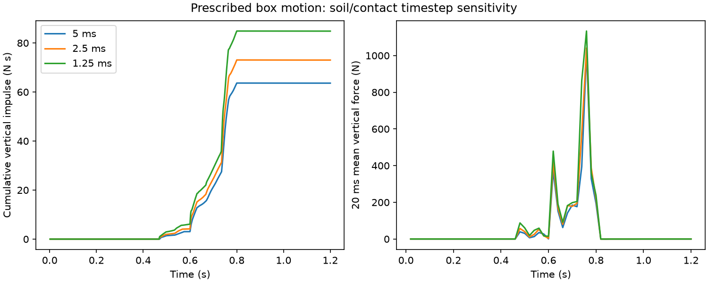

# Contact isolation and attempted coupling correction

## Adaptive feedback relaxation

The lagged proxy was tested with four coupling passes and Aitken relaxation, starting
at 0.5 and bounded by the solver's 0.1–1.0 defaults. The 5 ms controller period,
geometry, material, grid and inner solver settings match the earlier control.

| Physics step (ms) | Total vertical impulse (N s) | Peak 20 ms mean (N) | Minimum height (m) |
|---|---:|---:|---:|
| 5 | 10.509 | 39.47 | 0.17929 |
| 2.5 | 11.235 | 46.68 | 0.18538 |
| 1.25 | 12.827 | 54.39 | 0.19673 |

This attempted correction does not establish timestep convergence. It was not
promoted to a production default. All three cases completed without source changes;
records and canonical hashes are in `evidence/contact-aitken/`.

```sh
python scripts/check_coupling_refinement.py --iterations 4 --proxy-relaxation 0.5 --relaxation-mode aitken --output runs/contact-aitken
```

## Remove the controller and rigid feedback

The next fixture uses the same 120 × 120 × 80 mm box and 400 × 400 × 200 mm soil bed.
It prescribes the box origin from z=0.35 m downward at 0.3 m/s until 0.8 s and upward
at 0.3 m/s until 1.2 s. Orientation is fixed. Each timestep follows the same trajectory.
There is no rigid-body integration, force-limited actuator, or coupling-feedback loop.

The fixed MPM grid is 40 mm, particles are spaced 20 mm, density is 1600 kg/m³,
soil friction is 0.6 and tool friction is 0.5. The inner solve uses 100 iterations
and 1e-5 tolerance. Initial soil preparation is unchanged and has no separate settling
stage. This is an isolation fixture, not a laboratory replica.

| Physics step (ms) | Total vertical impulse (N s) | Peak 20 ms mean (N) |
|---|---:|---:|
| 5 | 63.615 | 1022.05 |
| 2.5 | 73.028 | 1041.16 |
| 1.25 | 84.832 | 1133.63 |



The successive impulse changes are approximately 14.8% and 16.2%. The discrepancy
persists with the motion and orientation prescribed. Therefore a rigid-feedback-only
correction cannot establish numerical qualification for this configuration. This does
not identify a specific upstream software bug or show that every Newton configuration
has this behavior. Spatial discretization, transfer, preparation and contact treatment
remain possible contributors.

The prescribed box penetrates farther than the force-limited box; its absolute forces
must not be compared as equivalent loads. They are not machine safety ratings.
All records include the exact input path and final particle positions, and report
unchanged source. They are in `evidence/contact-prescribed/` with canonical checksums.

```sh
python scripts/check_prescribed_contact.py --output runs/contact-prescribed
```

## Release consequence

The operating workflow remains usable for explicitly labeled experiments on its
discrete dynamics. Contact-force prediction and real-world transfer remain unqualified.
No material coefficient, acceptance tolerance, or frozen result was changed to make
these studies pass. Further qualification requires a demonstrably convergent physical
configuration or backend revision, followed by independent measured comparisons.
