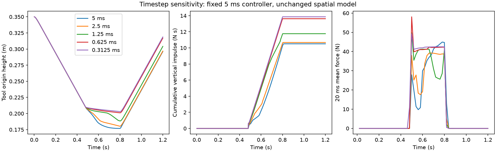

# Further contact timestep refinement

This extends the matched lagged-proxy penetration study using the same 5 ms
controller, 40 mm grid, 20 mm particle spacing, 100 MPM iterations and 1e-5
tolerance. No material, geometry, task goal or production backend default changed.
Both new runs completed with unchanged source. The full trajectories and canonical
checksums are in `evidence/contact-finer-steps/`.

| Physics step (ms) | Raw peak force (N) | Peak 20 ms mean (N) | Vertical impulse (N s) | Minimum origin height (m) |
|---|---:|---:|---:|---:|
| 5 | 54.36 | 44.92 | 10.507 | 0.17686 |
| 2.5 | 118.01 | 39.20 | 10.672 | 0.18028 |
| 1.25 | 256.00 | 49.75 | 11.764 | 0.18843 |
| 0.625 | 470.05 | 58.07 | 13.624 | 0.20108 |
| 0.3125 | 704.17 | 49.24 | 13.861 | 0.20298 |



The finest pair differs by about 1.74% in integrated impulse and 1.90 mm in
minimum height, a reduction from the previous pair. But its peak fixed-window force
still differs by about 15.2%. The coarse/fine difference extends into sustained
contact, rather than being confined to an instantaneous impact peak.

The raw force maximum is the impulse in one physics interval divided by that
interval's duration. Its growth alone does not prove nonconvergence of an impulsive
contact model. Motion, integrated impulse and declared measurement-bandwidth forces
must also be assessed. These measurements do not establish a converged operating
envelope, spatial convergence, or physical force accuracy. The contact gate remains
failed; no post-hoc tolerance was selected to turn these outcomes into a pass.

Reproduce the extension with:

```sh
python scripts/check_coupling_refinement.py --iterations 1 --mode lagged --dt 0.000625 0.0003125 --output runs/contact-finer-steps
```

The comparison includes older matched-control records with their own source hashes.
The two new records share one unchanged source identity. This is a deterministic
configuration study, not a set of independent stochastic replications.

## Inner-solver control

At 1.25 ms, increasing the MPM limit from 100 to 500 iterations and tightening
tolerance from 1e-5 to 1e-7 gives 11.750 N s total impulse, 49.96 N peak 20 ms mean
force, and 0.18853 m minimum height. The impulse differs from the matched control
by about 0.12%, and minimum height by about 0.10 mm. Those changes are much smaller
than the timestep differences. The raw peak changes from 256.00 to 282.99 N.

This control weakens the hypothesis that inadequate inner iteration alone explains
the sustained-contact discrepancy. It does not prove the inner solve converged at
every step: per-step residuals were not recorded. Its source remained unchanged.
The complete record and summary are `tight-solve.json` and `tight-solve-summary.json`.

```sh
python scripts/check_soil_coupling.py --steps 960 --dt 0.00125 --control-dt 0.005 --drive --mpm-iterations 500 --mpm-tolerance 1e-7 --output runs/contact-tight-solve.json
```

The study runner now rejects incompatible timesteps before GPU execution and exits
nonzero for failed cases or source changes. Fixture metadata now reports the chosen
coupling mode in both fields. Older staggered records have a stale top-level
`coupling_mode`; their `numerics.proxy_mode` correctly identifies the executed mode.
These runner/metadata fixes were made after the measurements and do not change physics.
