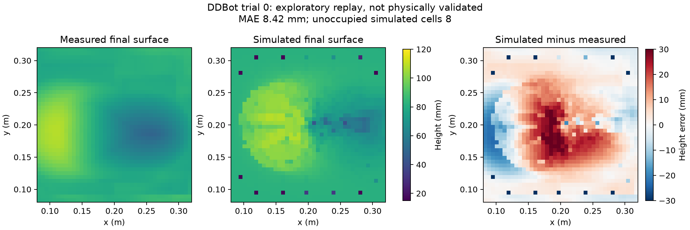

# Public terrain replay: development evidence

Source and reconstruction assumptions are recorded in [DATA_ADMISSION.md](DATA_ADMISSION.md).
The simulator uses Newton implicit MPM and the exact published shovel mesh. Planned
motion is replayed kinematically; this comparison does not validate actuation or
closed-loop control. Trial 0 is development data. Trial 1 has not been used for fitting.

## Stability investigation

Initial runs using thin box walls became nonfinite. Reducing the timestep delayed
failure but did not prevent it. A bounding-box tool failed as well, so the problem
was not confined to shovel-mesh contact. The box-control trace showed large particle
speeds and escape through the boundaries before failure.

A subsequent control uses an infinite floor and plane side boundaries at the same
inner bin coordinates. This completed the full trajectory. It changes both the
floor representation and side walls, so it does not isolate a unique boundary defect.
The plane walls extend above the real container rim; spillover claims are unsupported.
No artificial ceiling or clipping of the particle positions is applied.

## Initial full comparison

At 1 ms physics timestep, 14 mm grid spacing, 7 mm particle spacing, and uncalibrated
friction 0.6, the development-trial surface MAE was 8.42 mm. The unchanged initial
bed's MAE was 11.04 mm. There were eight unoccupied simulated height-map cells.
The primary metric follows the source's zero-initialized height map; those cells
remain visible rather than being filled or excluded to improve the score.

This is a first measured comparison, not a physical-validation pass. Similar MAE
does not imply similar spatial errors. The saved height maps and scientific figure
show the full difference field, including misplaced deposition and sampling gaps.

## Reproduction

```sh
python -m pip install -e ".[physics,data,plots]"
python scripts/fetch_validation_sources.py
python scripts/replay_ddbot.py --dt 0.001 --output runs/ddbot-development
python scripts/plot_validation.py --run runs/ddbot-development --data data/raw/admission/ddbot/e642f7c73f37539c21161bd29669fa8d91912b88 --output runs/ddbot-development.png
```

Each run records input checksums, package versions, numerical settings, source
hashes, particle bounds/speeds, and the surface array. Failed runs produce an explicit
failure record. Output directories cannot overwrite existing results.

Required remaining gates include timestep/spatial sensitivity, a declared calibration
protocol, a frozen independent evaluation, uncertainty bounds, and useful predefined
acceptance tolerances. A stable trajectory alone does not satisfy these requirements.

## Timestep study

| Physics timestep | Development MAE | Empty map cells |
|---|---:|---:|
| 5 ms | 7.62 mm | 7 |
| 2.5 ms | 7.95 mm | 8 |
| 1 ms | 8.42 mm | 8 |

Mean absolute differences between successive simulated surfaces are 1.35 and
1.60 mm. They do not decrease monotonically, so convergence is not established.
The [summary](evidence/terrain-replay/timestep-summary.json), individual reports,
height-map arrays, and selected earlier failures are retained together.



The subsequent development runs are governed by [TERRAIN_PROTOCOL.md](TERRAIN_PROTOCOL.md).

## Spatial and material sensitivity

| Development setting | Height MAE | RMSE | Empty cells |
|---|---:|---:|---:|
| 10 mm grid / 5 mm particles, 1 ms, friction 0.6 | 7.12 mm | 9.52 mm | 0 |
| 14 mm grid / 7 mm particles, 2.5 ms, friction 0.35 | 6.48 mm | 9.43 mm | 3 |
| 14 mm grid / 7 mm particles, 2.5 ms, friction 0.9 | 10.08 mm | 14.22 mm | 6 |

The fine-grid surface differs from the earlier coarse-grid 1 ms surface by 2.74 mm
MAE. A better development fit does not establish spatial convergence or select a
physically valid friction coefficient. No independent trial was evaluated.

[Reports and maps](evidence/terrain-sensitivity/summary.json) preserve a provenance
limitation: these runs recorded source changes during execution. Generated package
metadata and unrelated reporting work changed while they ran. The replay script hash
also differs from the earlier timestep baseline, so these are exploratory comparisons,
not a strict frozen-source convergence study. The dataset transform hash matches.
Future source fingerprints exclude generated package metadata and include test code.
